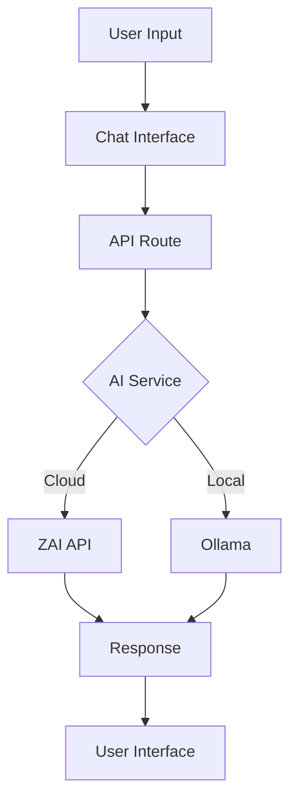
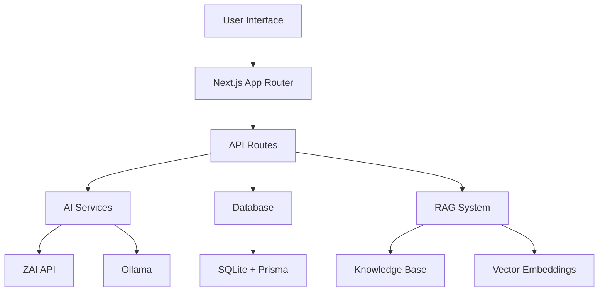

# DOCUSAURUS.md

Panduan lengkap untuk membuat dokumentasi aplikasi chatbot 7Connect menggunakan Docusaurus.io dengan bantuan Claude AI.

## Persiapan Awal

### 1. Install Docusaurus
```bash
# Install Docusaurus CLI
npm install -g @docusaurus/init@latest

# Inisialisasi dokumentasi baru
npx @docusaurus/init@latest init 7connect-docs classic

# Masuk ke folder dokumentasi
cd 7connect-docs
```

### 2. Struktur Folder yang Direkomendasikan
```
7connect-docs/
├── docs/
│   ├── intro.md                   # Pengenalan
│   ├── getting-started/
│   │   ├── installation.md        # Panduan instalasi
│   │   ├── configuration.md       # Konfigurasi
│   │   └── quick-start.md         # Quick start
│   ├── user-guide/
│   │   ├── chat-interface.md      # Panduan chat interface
│   │   ├── dashboard.md           # Panduan dashboard
│   │   ├── persona-management.md  # Manajemen persona
│   │   └── knowledge-base.md      # Basis pengetahuan
│   ├── technical/
│   │   ├── architecture.md        # Arsitektur sistem
│   │   ├── api-reference.md       # Referensi API
│   │   ├── database-schema.md     # Skema database
│   │   └── deployment.md          # Panduan deployment
│   ├── admin/
│   │   ├── user-management.md     # Manajemen pengguna
│   │   ├── billing.md             # Billing dan subscription
│   │   ├── analytics.md           # Analitik dan laporan
│   │   └ integrations.md          # Integrasi (WhatsApp, WordPress)
│   └── development/
│       ├── setup.md               # Setup development environment
│       ├── contributing.md        # Panduan kontribusi
│       ├── testing.md             # Testing
│       └── troubleshooting.md     # Troubleshooting
├── static/
│   ├── img/                       # Gambar dan screenshot
│   └── videos/                    # Video tutorial
├── src/
│   ├── css/
│   │   └── custom.css             # Custom styling
│   └── components/
│       └── CustomComponent.jsx    # Custom React components
├── blog/                          # Blog posts untuk update
├── docusaurus.config.js           # Konfigurasi utama
└── package.json
```

## Konfigurasi Docusaurus

### docusaurus.config.js
```javascript
const config = {
  title: '7Connect Chatbot Documentation',
  tagline: 'AI Assistant untuk Edukasi Islam dengan RAG Capabilities',
  url: 'https://docs.7connect.com',
  baseUrl: '/',
  onBrokenLinks: 'throw',
  onBrokenMarkdownLinks: 'warn',
  favicon: 'img/favicon.ico',
  organizationName: '7Connect',
  projectName: '7connect-docs',

  i18n: {
    defaultLocale: 'id',
    locales: ['id', 'en'],
    localeConfigs: {
      id: {
        label: 'Bahasa Indonesia',
        direction: 'ltr',
      },
      en: {
        label: 'English',
        direction: 'ltr',
      },
    },
  },

  presets: [
    [
      'classic',
      {
        docs: {
          sidebarPath: require.resolve('./sidebars.js'),
          editUrl: 'https://github.com/yourusername/7connect-docs/tree/main/',
        },
        blog: {
          showReadingTime: true,
          editUrl: 'https://github.com/yourusername/7connect-docs/tree/main/',
        },
        theme: {
          customCss: require.resolve('./src/css/custom.css'),
        },
      },
    ],
  ],

  themeConfig: {
    navbar: {
      title: '7Connect Docs',
      logo: {
        alt: '7Connect Logo',
        src: 'img/logo.svg',
      },
      items: [
        {
          type: 'doc',
          docId: 'intro',
          position: 'left',
          label: 'Dokumentasi',
        },
        {to: '/blog', label: 'Blog', position: 'left'},
        {
          href: 'https://github.com/yourusername/7connect',
          label: 'GitHub',
          position: 'right',
        },
        {
          type: 'localeDropdown',
          position: 'right',
        },
      ],
    },
    footer: {
      style: 'dark',
      links: [
        {
          title: 'Dokumentasi',
          items: [
            {
              label: 'Pengenalan',
              to: '/docs/intro',
            },
            {
              label: 'Quick Start',
              to: '/docs/getting-started/quick-start',
            },
          ],
        },
        {
          title: 'Komunitas',
          items: [
            {
              label: 'Discord',
              href: 'https://discord.gg/your-invite',
            },
            {
              label: 'Twitter',
              href: 'https://twitter.com/7connect',
            },
          ],
        },
        {
          title: 'More',
          items: [
            {
              label: 'Blog',
              to: '/blog',
            },
            {
              label: 'GitHub',
              href: 'https://github.com/yourusername/7connect',
            },
          ],
        },
      ],
      copyright: `Copyright © ${new Date().getFullYear()} 7Connect. Built with Docusaurus.`,
    },
    prism: {
      theme: require('prism-react-renderer/themes/github'),
      darkTheme: require('prism-react-renderer/themes/dracula'),
      additionalLanguages: ['bash', 'typescript', 'javascript', 'json', 'sql'],
    },
  },
};

module.exports = config;
```

### sidebars.js
```javascript
module.exports = {
  tutorialSidebar: [
    'intro',
    {
      type: 'category',
      label: 'Getting Started',
      collapsible: true,
      collapsed: false,
      items: [
        'getting-started/installation',
        'getting-started/configuration',
        'getting-started/quick-start',
      ],
    },
    {
      type: 'category',
      label: 'Panduan Pengguna',
      collapsible: true,
      collapsed: false,
      items: [
        'user-guide/chat-interface',
        'user-guide/dashboard',
        'user-guide/persona-management',
        'user-guide/knowledge-base',
      ],
    },
    {
      type: 'category',
      label: 'Administrasi',
      collapsible: true,
      collapsed: false,
      items: [
        'admin/user-management',
        'admin/billing',
        'admin/analytics',
        'admin/integrations',
      ],
    },
    {
      type: 'category',
      label: 'Technical Documentation',
      collapsible: true,
      collapsed: true,
      items: [
        'technical/architecture',
        'technical/api-reference',
        'technical/database-schema',
        'technical/deployment',
      ],
    },
    {
      type: 'category',
      label: 'Development',
      collapsible: true,
      collapsed: true,
      items: [
        'development/setup',
        'development/contributing',
        'development/testing',
        'development/troubleshooting',
      ],
    },
  ],
};
```

## Template Dokumentasi

### Prompt untuk Claude AI dalam Membuat Dokumentasi

Berikut adalah prompt-prompt yang bisa Anda gunakan saat bekerja dengan Claude AI:

#### **Prompt 1: Membuat Dokumentasi Awal**
```
Claude, tolong buatkan dokumentasi untuk aplikasi chatbot 7Connect berdasarkan informasi berikut:

**Context:**
- Aplikasi chatbot AI untuk edukasi Islam
- Dibangun dengan Next.js 14, TypeScript, Tailwind CSS
- Fitur: Chat interface, Dashboard, RAG system, Multi-language (ID/EN)
- Database: SQLite dengan Prisma ORM
- AI Services: ZAI API + Ollama fallback

**Buatkan file:**
1. docs/intro.md - Pengenalan lengkap aplikasi
2. docs/getting-started/installation.md - Panduan instalasi
3. docs/getting-started/quick-start.md - Quick start guide

Format Markdown dengan:
- Header yang jelas
- Code blocks untuk command
- Tables untuk fitur comparison
- Emojis untuk visual enhancement
- Struktur yang mudah dipahami untuk pemula
```

#### **Prompt 2: Dokumentasi Fitur Spesifik**
```
Claude, tolong buatkan dokumentasi untuk fitur [NAMA FITUR] dari aplikasi 7Connect.

**Informasi yang diperlukan:**
- Deskripsi lengkap fitur
- Cara penggunaan step-by-step
- Screenshots atau visual guide (gunakan placeholder)
- Tips dan best practices
- Troubleshooting common issues

**Target Audience:** Pengguna end-user (non-technical)
**Tone:** Friendly, instructional, dengan sedikit Islamic touch
**Format:** Markdown Docusaurus dengan:
- Frontmatter dengan proper tags
- Callout boxes untuk important notes
- Step-by-step instructions
- Code examples jika necessary
```

#### **Prompt 3: Dokumentasi Technical**
```
Claude, tolong buatkan dokumentasi teknis untuk [TOPIC] pada sistem 7Connect.

**Requirements:**
- Detail technical explanation
- Architecture diagrams (gunakan ASCII art)
- API endpoints documentation
- Code examples in TypeScript/JavaScript
- Database schema details
- Configuration examples

**Target Audience:** Developers and System Administrators
**Format:** Technical documentation dengan:
- Mermaid diagrams untuk flow/process
- OpenAPI spec untuk API
- Environment variable references
- Security considerations
- Performance optimization tips
```

#### **Prompt 4: Update & Maintenance**
```
Claude, berdasarkan perubahan terbaru pada aplikasi 7Connect, tolong:

1. Review dokumentasi yang sudah ada
2. Identifikasi bagian yang perlu diupdate
3. Buatkan changelog/update notes
4. Suggest improvements untuk existing docs

**Changes to Document:**
[List perubahan yang terjadi]

**Format:**
- Update existing files dengan track changes
- Create new documentation if needed
- Add proper versioning
- Migration guides if breaking changes
```

### Template Frontmatter untuk Docusaurus

```markdown
---
title: "Judul Dokumentasi"
description: "Deskripsi singkat tentang halaman ini"
sidebar_position: 1
sidebar_label: "Label di Sidebar"
tags: [tag1, tag2, tag3]
last_update:
  date: "2024-01-15"
  author: "Author Name"
---

# Konten dimulai di sini
```

## Content Guidelines

### 1. Writing Style Guidelines
- **Tone**: Professional namun friendly dengan Islamic touch
- **Language**: Bahasa Indonesia sebagai primary, English untuk technical terms
- **Structure**:
  - Introduction → Step-by-step → Examples → Summary
  - Gunakan headings yang jelas dan konsisten
  - Include visual elements (screenshots, diagrams)

### 2. Code Examples
```javascript
// Example: Chat API Usage
const response = await fetch('/api/chat', {
  method: 'POST',
  headers: {
    'Content-Type': 'application/json',
  },
  body: JSON.stringify({
    message: 'Assalamualaikum, saya ingin bertanya tentang...',
    userId: 'user123',
    sessionId: 'session456'
  })
});

const data = await response.json();
console.log(data.response);
```

### 3. Callout Components
```markdown
:::note Tips
Gunakan fitur persona untuk customisasi respons AI sesuai dengan audience Anda.
:::

:::warning Important
Pastikan environment variables sudah dikonfigurasi dengan benar sebelum menjalankan aplikasi.
:::

:::info Integration
7Connect mendukung integrasi dengan WhatsApp dan WordPress untuk deployment yang lebih luas.
:::

:::danger Security
Jangan pernah commit API keys atau sensitive credentials ke repository!
:::
```

### 4. Interactive Elements
```markdown
- **Tabs untuk multiple options**:
import Tabs from '@theme/Tabs';
import TabItem from '@theme/TabItem';

<Tabs>
<TabItem value="npm" label="NPM" default>
```bash
npm install @7connect/chatbot
```
</TabItem>
<TabItem value="yarn" label="Yarn">
```bash
yarn add @7connect/chatbot
```
</TabItem>
</Tabs>

- **Mermaid Diagrams**:


## Customization

### Custom CSS (src/css/custom.css)
```css
/* 7Connect Theme Customization */
:root {
  --ifm-color-primary: #059669;
  --ifm-color-primary-dark: #047857;
  --ifm-color-primary-darker: #065f46;
  --ifm-color-primary-light: #10b981;
  --ifm-color-primary-lighter: #34d399;
}

/* Islamic-themed styling */
.hero__title {
  background: linear-gradient(135deg, #059669, #10b981, #34d399);
  -webkit-background-clip: text;
  -webkit-text-fill-color: transparent;
}

/* Custom code blocks */
.theme-code-block {
  border-left: 4px solid var(--ifm-color-primary);
}

/* Custom callouts */
div[class*='alert--info'] {
  border-left: 4px solid #059669;
}
```

### Custom Components
```jsx
// src/components/FeatureCard.jsx
import React from 'react';
import clsx from 'clsx';

export default function FeatureCard({title, description, icon, link}) {
  return (
    <div className={clsx('col col--4')}>
      <div className="card">
        <div className="card__header">
          <h3>{icon} {title}</h3>
        </div>
        <div className="card__body">
          <p>{description}</p>
        </div>
        <div className="card__footer">
          <a className="button button--primary button--block" href={link}>
            Learn More
          </a>
        </div>
      </div>
    </div>
  );
}
```

## Development Workflow

### 1. Local Development
```bash
# Install dependencies
npm install

# Start development server
npm run start

# Build for production
npm run build

# Serve production build
npm run serve
```

### 2. Content Creation Process
1. **Planning**: Buat outline dan structure
2. **Drafting**: Gunakan Claude AI untuk draft awal
3. **Review**: Edit dan enhance manual
4. **Testing**: Pastikan semua links dan components work
5. **Deployment**: Build dan deploy ke production

### 3. Quality Checklist
- [ ] All internal links work
- [ ] Code blocks have correct syntax highlighting
- [ ] Images have alt text
- [ ] Frontmatter is complete
- [ ] Mobile responsiveness checked
- [ ] SEO meta tags optimized
- [ ] Translation consistency (ID/EN)

## Deployment Options

### 1. GitHub Pages
```bash
# Install GitHub Pages package
npm install --save gh-pages

# Add to package.json
"scripts": {
  "deploy": "docusaurus deploy",
  "deploy:gh": "USE_SSH=true npm run deploy"
}
```

### 2. Vercel/Netlify
- Connect GitHub repository
- Set build command: `npm run build`
- Set publish directory: `build`
- Configure custom domain

### 3. Self-hosted
```bash
# Build static files
npm run build

# Deploy to web server
rsync -av build/ user@server:/var/www/7connect-docs/
```

## Maintenance Strategy

### 1. Regular Updates
- Review documentation setiap bulan
- Update dengan fitur baru
- Fix broken links
- Improve based on user feedback

### 2. Versioning
- Gunakan semantic versioning untuk dokumentasi
- Maintain previous versions untuk backward compatibility
- Changelog untuk setiap update

### 3. Analytics
- Track popular pages
- Monitor search terms
- User feedback collection
- Heatmap analysis

## Sample Content Structure

### docs/intro.md
```markdown
---
title: "Pengenalan 7Connect"
description: "AI Assistant untuk Edukasi Islam dengan RAG Capabilities"
sidebar_position: 1
tags: [intro, overview, 7connect]
last_update:
  date: "2024-01-15"
  author: "7Connect Team"
---

# Selamat Datang di 7Connect 🤖

7Connect adalah chatbot AI berbasis web yang dirancang khusus untuk **edukasi Islam** dengan kemampuan **RAG (Retrieval-Augmented Generation)** untuk memberikan jawaban yang akurat dan kontekstual.

## ✨ Fitur Utama

### 🎯 **Chat Interface**
- Interface modern dengan tema Islamic green
- Support 1000 karakter per pesan
- Markdown rendering dan auto-scroll
- Real-time responses dengan loading states

### 📊 **Dashboard Analytics**
- Monitoring percakapan real-time
- Statistik penggunaan dan engagement
- Knowledge base analytics
- Bilingual support (Indonesia/English)

### 🧠 **RAG System**
- Knowledge base dengan vector embeddings
- Document indexing dan semantic search
- Enhanced AI responses dengan domain knowledge
- Multiple data source support

### 🔧 **AI Services**
- **ZAI API** untuk cloud-based processing
- **Ollama** untuk local LLM inference
- Smart fallback system
- Consistent Islamic education prompts

### 🌐 **Multi-language Support**
- Indonesian (default) dan English
- Language switcher di dashboard
- Translated UI components
- Localized content management

### 📱 **Integrations**
- WhatsApp integration
- WordPress plugin
- Embed chat widget
- Instagram & Facebook (coming soon)

## 🏗️ Arsitektur Teknis



## 🚀 Quick Start

### Prerequisites
- Node.js 18+
- npm atau yarn
- Git

### Installation

<Tabs>
<TabItem value="clone" label="1. Clone Repository" default>
```bash
git clone https://github.com/yourusername/7connect.git
cd 7connect
```
</TabItem>
<TabItem value="install" label="2. Install Dependencies">
```bash
npm install
```
</TabItem>
<TabItem value="database" label="3. Setup Database">
```bash
npm run db:push
npm run db:generate
```
</TabItem>
<TabItem value="start" label="4. Start Development">
```bash
npm run dev
```
</TabItem>
</Tabs>

### Konfigurasi Awal

Buat file `.env.local` dengan konfigurasi berikut:

```env
# Database
DATABASE_URL="file:./dev.db"

# AI Services (Optional - untuk Ollama)
OLLAMA_BASE_URL="http://localhost:11434"
OLLAMA_MODEL="llama2"

# Jika tidak menggunakan Ollama, akan fallback ke ZAI API
```

## 📖 Panduan Navigasi

Dokumentasi ini terstruktur untuk membantu Anda:

1. **[Getting Started](/docs/getting-started/installation)** - Setup dan konfigurasi awal
2. **[User Guide](/docs/user-guide/chat-interface)** - Panduan penggunaan fitur
3. **[Administration](/docs/admin/user-management)** - Manajemen sistem dan billing
4. **[Technical Documentation](/docs/technical/architecture)** - Detail teknis dan API
5. **[Development](/docs/development/setup)** - Panduan untuk developer

## 🤝 Dukungan Komunitas

- **Discord**: [Join our community](https://discord.gg/7connect)
- **GitHub**: [Report issues](https://github.com/yourusername/7connect/issues)
- **Documentation**: [Contribute to docs](https://github.com/yourusername/7connect-docs)

:::note Islamic Focus
7Connect dirancang khusus untuk edukasi Islam dengan respons yang sesuai dengan nilai-nilai Islamic dan referensi yang valid.
:::

## 📄 Lisensi

7Connect dilisensikan under [MIT License](https://opensource.org/licenses/MIT).

---

**Mulai perjalanan Anda dengan 7Connect hari ini!** 🚀
```

## Commands for Claude AI

### Command Template untuk Update Dokumentasi
```
Claude, tolong update dokumentasi [TOPIK] berdasarkan informasi terbaru:

**Context:**
- Aplikasi chatbot 7Connect sudah ada di /home/asif/Develop/chatbot
- Fitur yang sudah ada: chat interface, dashboard, RAG system, billing, integrations
- Tech stack: Next.js 14, TypeScript, Tailwind CSS, Prisma, SQLite

**Tasks:**
1. Baca file-file yang relevan dari source code
2. Analisis implementasi saat ini
3. Update dokumentasi yang sudah ada
4. Tambahkan informasi baru jika necessary
5. Pastikan consistency dengan existing docs

**Format:**
- Gunakan Markdown Docusaurus
- Include proper frontmatter
- Add code examples
- Include screenshots/diagrams jika needed
```

### Command untuk Review dan Enhancement
```
Claude, tolong review dan enhance dokumentasi 7Connect:

**Checklist:**
- [ ] Accuracy of technical information
- [ ] Consistency in tone and style
- [ ] Completeness of examples
- [ ] Clarity of instructions
- [ ] Mobile responsiveness considerations
- [ ] SEO optimization
- [ ] Translation consistency (ID/EN)

**Improvements Needed:**
- Add more practical examples
- Include troubleshooting sections
- Enhance visual elements
- Improve navigation flow
- Add best practices sections
```

## Next Steps

Setelah membaca panduan ini, Anda siap untuk:

1. **Initialize Docusaurus project** untuk 7Connect
2. **Create initial documentation structure**
3. **Work with Claude AI** untuk generate content
4. **Customize theme dan styling** sesuai brand 7Connect
5. **Deploy documentation** ke platform pilihan Anda

Gunakan prompt-prompt di atas untuk bekerja efektif dengan Claude AI dalam membuat dokumentasi yang komprehensif dan user-friendly untuk aplikasi 7Connect.